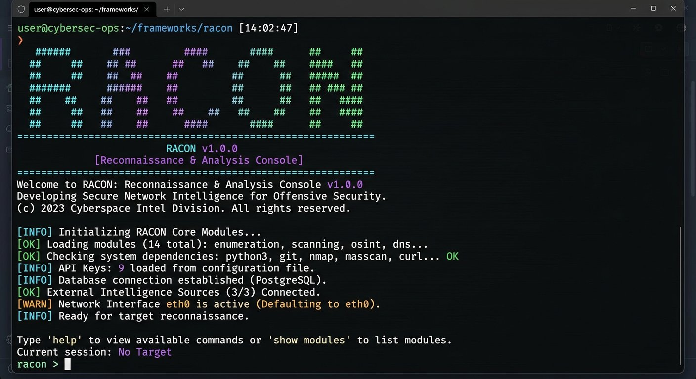
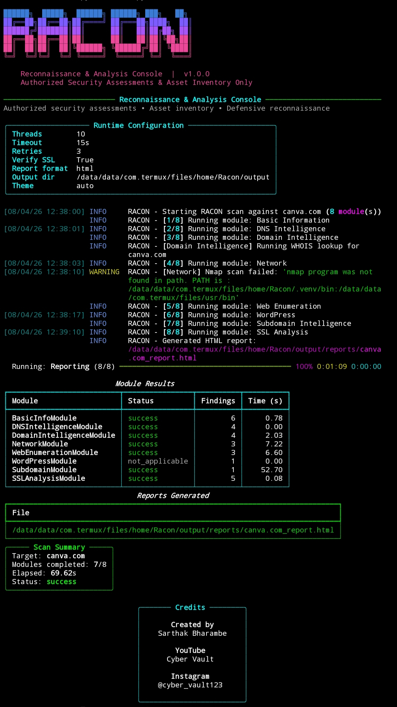
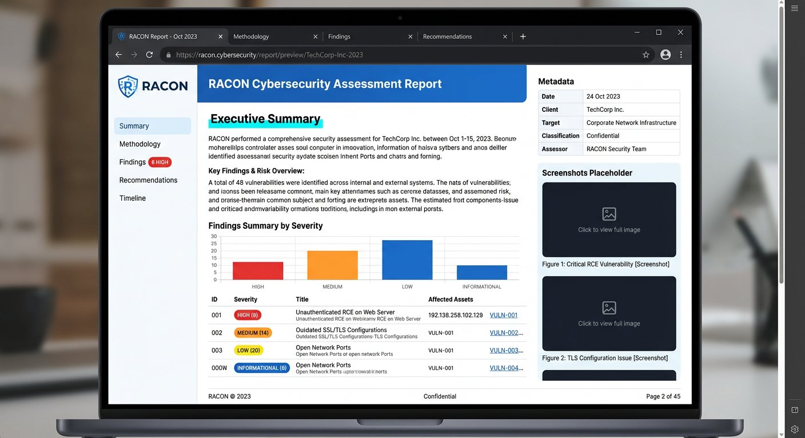

<p align="center">
  
</p>

<h1 align="center">RACON</h1>
<h3 align="center">Reconnaissance & Analysis Console</h3>

<p align="center">
A modern, modular and professional OSINT & reconnaissance framework built for
authorized security assessments, asset discovery and defensive security research.
</p>

<p align="center">
  
  
  
  
</p>

---

## Overview

RACON (Reconnaissance & Analysis Console) is a professional reconnaissance and OSINT framework designed for defensive cybersecurity operations.

It combines multiple reconnaissance modules into one clean terminal interface while generating professional HTML, JSON, CSV and PDF reports.

> **For authorized security assessments and defensive reconnaissance only.**

---

# Features

- Professional Rich Terminal UI
- Multi-threaded Scanning
- DNS Intelligence
- WHOIS Lookup
- HTTP Header Analysis
- Web Technology Detection
- CMS Detection
- Cloudflare Detection
- SSL/TLS Analysis
- robots.txt Scanner
- Sitemap Discovery
- Security Header Analysis
- Banner Grabbing
- WordPress Detection
- Passive Subdomain Enumeration
- HTML / JSON / CSV / PDF Reports
- Cross Platform Support
- Termux Compatible

---

# Screenshots

## Startup

<p align="center">

</p>

---

## Full Scan

<p align="center">

</p>

---

## Report Generation

<p align="center">

</p>

---

# Installation

```bash
git clone https://github.com/cybervault-Hacky/Racon.git

cd Racon

python -m venv .venv

source .venv/bin/activate

pip install -r requirements.txt

__________________________________________

# Quick Start

* Basic Scan =
python racon.py -t example.com

* Generate All Reports =
python racon.py -t example.com -f all

* Specific Modules =
python racon.py -t example.com --modules

* basic_info,dns_intelligence
Interactive Mode =
python racon.py --command

* Project Structure
RACON
│
├── assets
├── core
├── modules
├── templates
├── docs
├── output
├── tests
├── requirements.txt
├── config.yaml
├── racon.py
└── README.md
Reports

* RACON automatically generates professional reports including
==>
   °HTML
   °JSON
   °CSV
   °PDF

Reports are saved inside
output/reports/
Documentation

* Installation Guide
* Usage Guide
* Module Reference
* Feature List
* Roadmap
* Contributing Guide
* Termux Guide
* Platform Support
* Platform
* Supported

* Linux = ✅

* Windows = ✅

* macOS = ✅

* Termux = ✅

Author 
Sarthak Bharambe

YouTube: Cyber Vault

Instagram: @cyber_vault123

License
MIT License

Made with ❤️ for the Cybersecurity Community

Created by Sarthak Bharambe

